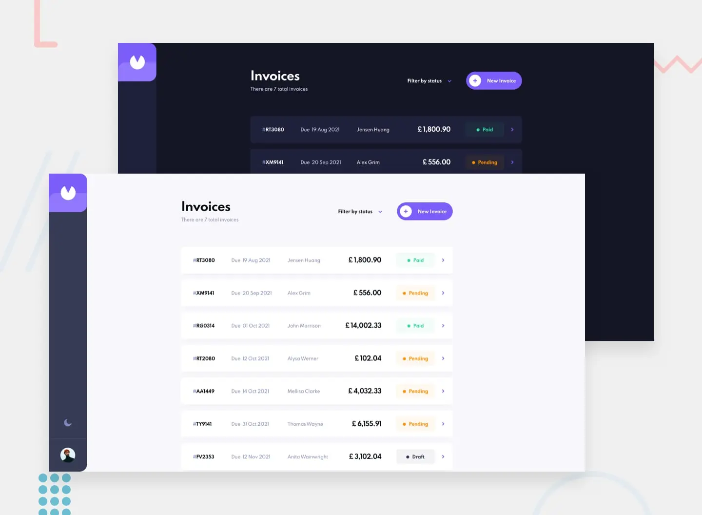

<div align="center">
  <h1>🤖 Invoice App</h1>

A simple web application for invoice management using Next.js, TypeScript, Zustand and React Hook Form

[You can view the page by clicking here](https://invoice-app-9l4.pages.dev)



</div>

## 🚀 How to use?

First clone the repository from GitHub:

```shell
git clone https://github.com/JoseLuria/invoice-app.git
```

Move to the project folder:

```shell
cd invoice-app
```

Install the dependencies with the following command:

```shell
npm install
```

Install the husky pre-commit:

```shell
npm run husky
```

Start the **development** environment with the following command

```shell
npm run dev
```

## ⚙️ This application was built using the following technologies

- [TypeScript](https://www.npmjs.com/package/typescript)
- [Zod](https://www.npmjs.com/package/zod)
- [Standard](https://www.npmjs.com/package/ts-standard)
- [ESLint](https://www.npmjs.com/package/eslint)
- [Prettier](https://www.npmjs.com/package/prettier)
- [Next.js](https://nextjs.org)
- [Tailwind](https://tailwindcss.com)
- [React Hook Form](https://react-hook-form.com)
- [Clsx](https://www.npmjs.com/package/clsx)

## 📄 License

[MIT](https://opensource.org/licenses/MIT)
